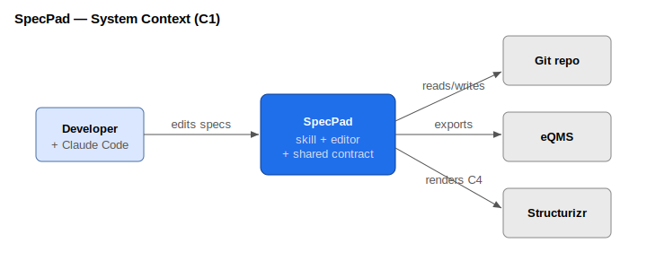
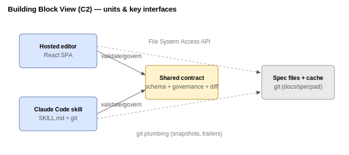
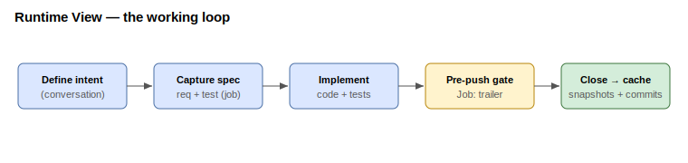
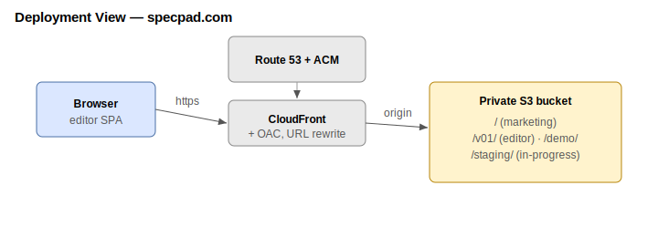

# SpecPad — Software Architecture Document (arc42)

> Generic profile (SpecPad is not a medical device — it's a faithful structural example). Diagrams are
> draw.io SVG exports, placed inline by this document; a Structurizr C4 model is an optional alternative.
> Job/release-coupled — the Jobs view shows how each change affected this. Authoring tact:
> `specpad.sad.guide.md`.

## 1. Introduction and Goals
SpecPad governs structured software documentation (requirements, verification tests, and architecture)
as files in a git repo, edited by a Claude Code skill and a hosted visual editor under one shared
contract, producing change-tracked, exportable design evidence. Quality goals: **low install friction**,
a **documentation digital-twin of the code**, and **reproducible, audit-grade evidence**. Stakeholders:
developers (with Claude Code), human spec editors, and (for regulated users) eQMS reviewers.

## 2. Constraints
- Static, backend-less hosted editor (S3 + CloudFront); file I/O is client-side (File System Access API).
- One shared v1 JSON contract governs the editor and the skill; git owns history.
- Version-pinned editor builds (`schemaVersion "1.0"` → `/v01/`); old builds stay live forever.
- The skill is prose + git plumbing (no CLI).

## 3. Context and Scope
A **developer** authors specs/code with Claude Code; a **reviewer** approves evidence in an external
**eQMS**. SpecPad reads/writes `docs/specpad/` in the developer's git repo, renders in the hosted
editor, and exports evidence.

## 4. Solution Strategy
- **Contract-first:** `src/shared/` is the single source of truth both halves obey.
- **Skill writes programmatically; humans edit visually; git merges.**
- **Change tracking is git-derived** (release baselines + frozen closed-job caches) so the
  browser-based editor shows history without git access.
- **Jobs are the change spine:** a job ties its SRS/VTP/architecture edits and code commits together.

## 5. Building Block View
Top-level units and the key interfaces between them:

| Unit | Responsibility | Key interfaces |
|------|----------------|----------------|
| Shared contract (`src/shared`) | Types + JSON Schemas, governance, id-keyed diff | imported by editor; mirrored by skill |
| Editor (`src/`) | React SPA: SRS/VTP/Jobs/Architecture/Results views; local file I/O | File System Access API; the contract |
| Skill (`skill/specpad`) | Scaffold, govern, cache, export; git plumbing | git; the contract; the eQMS export |
| Spec files + cache (`docs/specpad`) | proj/srs/vtp JSON, sad.md, diagrams, `.specpad/` baselines & job caches | git |

## 6. Runtime View
The working loop: define intent → capture requirements/tests/architecture **spec-first** under an active
job → implement → the **pre-push hook** enforces a `Job:` trailer → on close the skill caches the job's
before/after snapshots + commit list. The editor diffs the caches to show each job's impact.

## 7. Deployment View
Private S3 bucket behind CloudFront (OAC), Route 53, ACM. Apex = marketing; `/v01/` = editor;
`/demo/` = demo content; `/staging/` = in-progress builds. Provisioned by the private `specpad-infra`
repo's `deploy.sh`.

## 8. Crosscutting Concepts
Stable immutable ids; references target ids never labels; nothing derived is stored except the
committed, regenerable "lockfile" caches (release baselines, closed-job caches); governance enforced
identically by editor and skill from one module.

## 9. Architecture Decisions
Hosted-only editor with a version-pinned redirect launcher; git-derived change tracking; job-level
coupling for architecture (no req↔arch matrix); architecture authored as arc42 markdown + draw.io
diagrams (Structurizr C4 DSL optional); enforcement via an opt-in pre-push hook.

## 10. Quality Requirements
Install friction (one `init`); contract integrity (editor ↔ skill governance parity, parity-tested);
reproducibility of evidence (deterministic, versioned, git-backed); traceability (req↔test via
`verifies`, job→code via the `Job:` trailer).

## 11. Risks and Technical Debt
Per-job architecture diffs accrue only for jobs closed after the SAD exists (and are coarse — "the
diagram/doc changed"); the eQMS export format is not finalized; third-party components (SOUP/SBOM) and
cybersecurity architecture are planned, not yet built.

## 12. Glossary
SRS (requirements), VTP (verification tests), SAD (this document), SDD (detailed design — future),
Job (a design change), Release (a design checkpoint), SOUP/OTS (third-party software — future SBOM
pillar), eQMS (external quality system of record).
