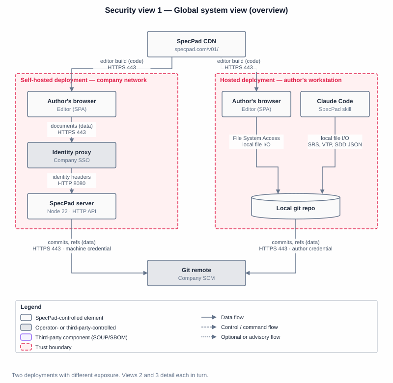
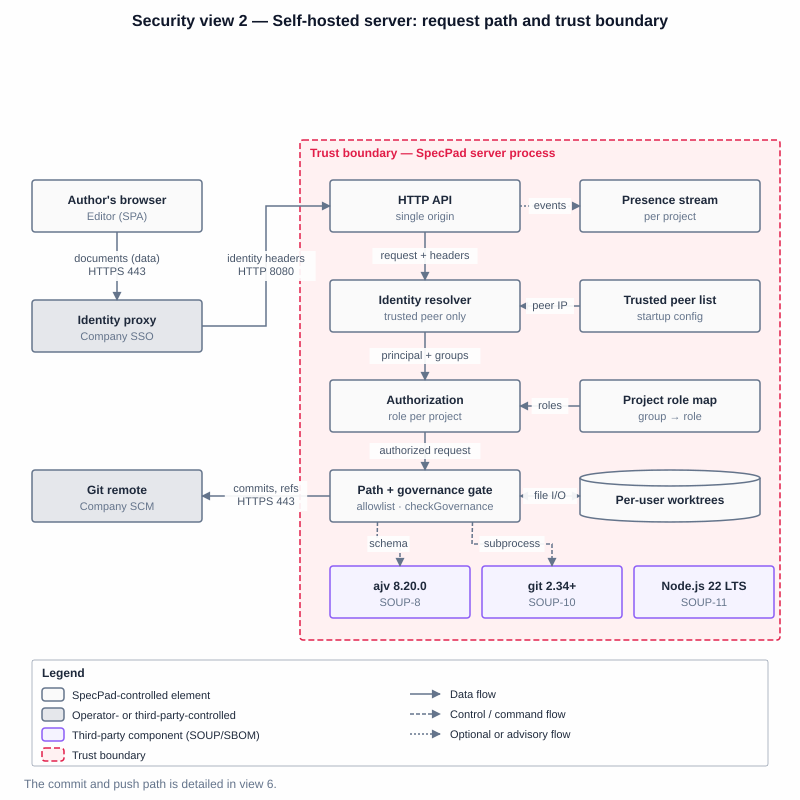
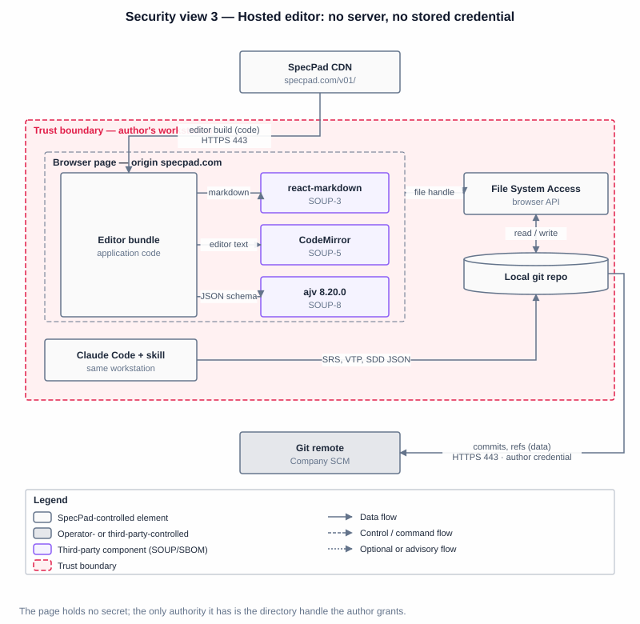
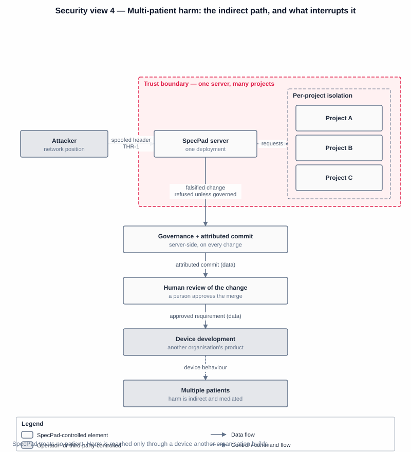
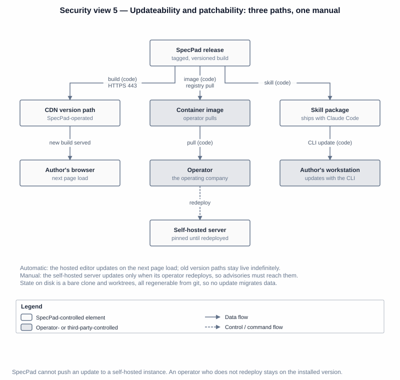
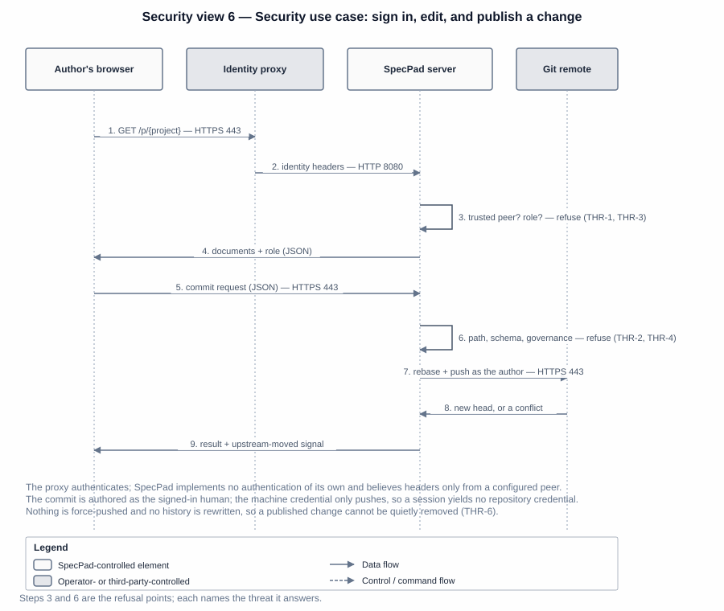

# SpecPad — Security Architecture

> The architecture views a premarket submission is expected to contain (FDA, *Cybersecurity in
> Medical Devices: Quality Management System Considerations and Content of Premarket Submissions*,
> 3 February 2026 — which supersedes the June 2025 edition and aligns the guidance with the QMSR),
> with the security development lifecycle of IEC 81001-5-1 behind them. The threat model itself is
> `specpad.threat.json`; this document describes the system those threats act against. Where this and
> the arc42 architecture describe the same structure, the arc42 document is the source and this one is
> the security reading of it.

Six views follow. The guidance names four *types* of view and then says plainly that a single global
view need not carry every data flow — additional views may detail the communications instead. SpecPad
takes that option: one system-level overview, then one view per deployment, because the hosted editor
and the self-hosted server have almost nothing in common in their exposure and drawing them as one
diagram would misrepresent both.

Every figure follows the same conventions: each connector is labelled with what traverses it and over
what protocol, trust boundaries are drawn in dashed red, third-party components carry the SOUP colour
and their `SOUP-n` code, and each figure carries a legend.

## Critical user roles

Three roles appear in the views. They are resolved per project, never per deployment.

| Role | Holds | Can |
|---|---|---|
| Reader | A group claim mapped to `read` on a project | Read that project's documents; see presence |
| Editor | A group claim mapped to `write` on a project | Everything a reader can, plus commit a change |
| Operator | Shell access to the server host | Configure the trusted peer list and role map; redeploy |

The operator is not a SpecPad account. It is the person who installs the software, and the trust the
system places in an upstream proxy is a configuration they own rather than something a user can assert.

## 1. Global system view — overview

The whole system, and every connection into and out of it.

SpecPad has two deployments with very different exposure, and conflating them is the first mistake a
reader can make.

**Hosted editor.** A static page served from a CDN, running entirely in the browser against the user's
own filesystem through the File System Access API. It has no server, no session, no stored credential
and no data at rest beyond the user's own repository. Its only network traffic is fetching its own
build and, in demo mode, a set of read-only sample documents. Detailed in view 3.

**Self-hosted server.** The exposed deployment: one process serving the same editor build and an HTTP
API from a single origin, inside the company network. Detailed in view 2.

Two properties define the perimeter, and both views depend on them. **SpecPad implements no
authentication**: identity is asserted by an upstream the company already runs, and headers from any
other peer are ignored. And **identity is not the git credential**: the human is the commit author, a
machine credential performs the push, so compromising a session does not yield repository credentials.

### 1.1 Communication paths

Every path between two assets, per Appendix 2 of the guidance. Protocol versions and ports are the
defaults; an operator may place the server behind a different port, and the trusted-peer configuration
moves with it.

| # | Path | Carries | Protocol · port | Authenticated by | Authorized by | Threats | Controls |
|---|---|---|---|---|---|---|---|
| P1 | Browser → identity proxy | Document JSON (data) | HTTPS/TLS 1.3 · 443 | The company's SSO | Proxy policy | — | Operator-owned |
| P2 | Proxy → server | Identity headers (data) | HTTP/1.1 · 8080, loopback or private | Peer address allowlist | — | THR-1 | AUTH-2, AUTH-5 |
| P3 | Server → git remote | Commits, refs (data) | HTTPS · 443, SSH optional | Machine credential | Remote's own ACL | THR-4, THR-6 | AUTH-6, CMT-5 |
| P4 | Server → filesystem | Worktree files (data) | Local file I/O, confined to the work directory | — | Path allowlist + per-project directory | THR-3, THR-4 | SRV-2, SRV-3, MPT-6 |
| P5 | Server → git binary | Commands (control) | Local subprocess, argument vector — never a shell | — | Path validated before it is passed | THR-4 | SRV-2 |
| P6 | Browser → CDN | Editor build (code) | HTTPS/TLS 1.3 · 443 | — (public, integrity by TLS) | — | THR-7 | Versioned path |
| P7 | Browser → local filesystem | Document JSON (data) | File System Access API | The author's own grant | The directory handle granted | — | Browser-enforced |
| P8 | Skill → local filesystem | Document JSON (data) | Local file I/O | The author's own session | Filesystem permissions | — | — |
| P9 | Local repo → git remote | Commits, refs (data) | HTTPS · 443 | The author's own credential | Remote's own ACL | — | Git, not SpecPad |
| P10 | Server → browser | Presence events (advisory) | HTTP event stream over the P1/P2 path | As P2 | Role in that project | THR-9 | MPT-8, AUTH-5 |

**Unused interfaces.** The server opens exactly one listening port and serves one origin. It exposes no
administrative interface, no debug endpoint, and no second listener; configuration is read at startup
from the environment and the process must be restarted to change it. There is no dormant functionality
to disable because there is no second path in.

**Handoff.** One handoff exists, P1 → P2: the proxy terminates TLS and re-originates the request over
plain HTTP carrying identity headers. Integrity across that hop rests on the hop being local or on a
trusted private segment, and on the server believing those headers from configured peer addresses only.
This is the deployment's single most important assumption, and a deployment naming no trusted peer
**refuses to start** rather than defaulting to trusting everyone.

**Cryptography.** SpecPad implements none of its own. Transport confidentiality on P1, P3, P6 and P9 is
TLS as provided by the platform (Node.js 22, SOUP-11) or by the browser; commit integrity is git's
content-addressed object model (SOUP-10). There is no proprietary algorithm, no key SpecPad generates,
and no secret at rest other than the machine credential, which is supplied by the operator through the
environment and never written to the work directory.

**Sessions.** SpecPad maintains no session of its own: every request is authorized from the headers
presented on that request. There is nothing to fixate, replay after expiry, or steal from storage. The
proxy's session is the operator's to manage.

**Unexpected termination.** A request that dies mid-write leaves the worktree dirty but the repository
consistent, because nothing is published until the commit succeeds and the push is a separate,
retryable step. A push that loses its race is rebased and retried rather than forced.

## 2. Global system view — the self-hosted server

The exposed deployment, one level down: what a request passes through, and where each refusal happens.

A request crosses the boundary once, at the HTTP API, and is then narrowed four times. Identity is
resolved first and only from a trusted peer (P2). Authorization resolves a role **for the named
project**, from the group claims the proxy asserted against the operator's role map. The path and
governance gate then validates the document path against an allowlist grammar and runs
`checkGovernance` over the resulting change. Only then does anything touch the filesystem.

The ordering matters and is the control: a request that fails at any stage never reaches the next, so a
path bug cannot be exercised by a caller who was never authorized, and an unauthorized caller cannot
learn whether a project exists.

Three third-party components sit inside this boundary. `ajv` (SOUP-8) validates document structure,
`git` (SOUP-10) is executed as a subprocess with an argument vector rather than through a shell, and
Node.js (SOUP-11) provides TLS, filesystem and process primitives. All three are in the SBOM, and
SOUP-10's sparse-checkout support is itself a security control — it is why the working tree cannot
contain application source for a path bug to reach.

## 3. Global system view — the hosted editor

The unexposed deployment. Included because a view whose answer is "almost nothing" is still an answer,
and because reviewers reasonably ask what the public page can reach.

The page is static, served from a versioned path, and holds no credential. The only authority it
acquires is a directory handle the author grants through the browser's own permission prompt, revocable
by the author and scoped by the browser to the directory chosen. There is no server to attack, no
session to steal, and no data at rest that the author does not already own.

What remains is supply chain and rendering. Four third-party components execute in the page:
`react-markdown` (SOUP-3), which renders document bodies authored by other people, CodeMirror
(SOUP-5), `ajv` (SOUP-8), and React (SOUP-1/2, not drawn). The renderer emits no raw HTML and no
raw-HTML plugin is configured, so content cannot become markup (THR-5) — a property of a supplied
component, which is why it is recorded as a requirement placed on that supplier rather than as code
written here.

## 4. Multi-patient harm view

How an attack on one deployment could reach beyond it.

SpecPad is a documentation tool, not a device that treats anyone; it has no patient-facing function and
no fleet. The multi-patient reading of this view is therefore indirect, and worth drawing rather than
dismissing: **a compromised specification could misinform the development of a device that does treat
patients.** A falsified requirement or a silently weakened verification record is the harm path, and it
is slow, indirect, and mediated by human review.

The diagram shows that path and, more usefully, the two gates that interrupt it. Neither is a
confidentiality control; both make the record *trustworthy*:

- Every change is a git commit attributed to a person, and nothing is force-pushed or rewritten, so a
  falsified change cannot be made to disappear.
- Governance runs server-side, so a change that breaks traceability is refused regardless of the client.
- Verification results are derived from a captured run rather than typed, so a passing claim cannot be
  asserted by hand.
- A person reviews and approves the merge downstream. This is the gate SpecPad does not own, and it is
  the reason the harm path is long: no specification change reaches a device without a human agreeing
  to it.

**Blast radius across projects.** A server hosting several projects is the one place where one team's
compromise could reach another's specification, and it is the only genuinely multi-tenant surface in
the system. Authorization is resolved per project rather than per deployment, and each project holds a
separate clone and per-user worktree, so the boundary is structural rather than filtered (THR-3).

**Simultaneous compromise.** The guidance asks specifically about many devices failing at once. The
equivalent here is a single server serving every team in a company: its loss stops all of them working
at the same moment. Impact is bounded because the specification lives in git and every worktree is
regenerable — an unavailable server delays work rather than losing it (THR-8).

## 5. Updateability and patchability view

The end-to-end path by which a fix reaches a deployed instance.

| Deployment | Update path | Who acts | Automatic? |
|---|---|---|---|
| Hosted editor | New build published to the version path; next page load has it | SpecPad | Yes |
| Self-hosted server | New container image or checkout; operator redeploys | The operating company | No |
| The skill | Distributed with Claude Code; updated with it | The user | With the CLI |

The version path (`/v01/`) is derived from the contract version and old paths stay live indefinitely,
so an update never breaks a document authored against an earlier contract. A server deployment pins
whatever image the operator installed: **SpecPad cannot push an update to a self-hosted instance**, and
an operator who does nothing stays on the version they have. That is a deliberate property of
self-hosting rather than a gap — a documentation tool that could silently replace its own code inside a
company network would be a worse security position, not a better one — but it makes the vulnerability
communication plan the mechanism that matters.

State on disk is a bare clone and per-user worktrees under the work directory, all regenerable from
git, so an update never migrates data and a rollback loses nothing.

**Not yet documented:** monitoring of advisories, triage, disclosure to operators, and the timeline for
issuing a patched image. Recorded as gap 4 against JOB-51 rather than left implied.

## 6. Security use cases

The flows where an attacker's interest and the system's function meet. The call flow below is the
principal one — signing in, reading, and publishing — because those steps share a communication path
and a security assessment, which the guidance allows to be documented once rather than repeated per
clinical state.

**Signing in.** The proxy authenticates and asserts identity headers; the server maps group claims to a
role per project. A request from an untrusted peer is refused before any identity is read (THR-1). A
principal holding no role in a project is refused that project without affecting the others (THR-3).

**Reading and editing.** A read requires a role; a write requires one that permits editing, refused
server-side whatever the client rendered (THR-2). Every document path is validated before it reaches
git, and the working tree is sparse-checked-out so it cannot contain application source (THR-4).

**Publishing.** The commit gate validates and governs the change, commits it as the authenticated
human, rebases onto the branch and pushes with the machine credential. Nothing is force-pushed. A
concurrent change is merged structurally by item id, never textually, so a merge cannot silently drop
or duplicate content (THR-6).

**Rendering someone else's content.** Document bodies are authored by several people and rendered in
each other's browsers. The renderer emits no raw HTML and no raw-HTML plugin is configured, so content
cannot become markup (THR-5).

**Watching who is present.** Advisory presence is scoped to a project and requires a role in it, so it
never crosses a project boundary (THR-9). It is deliberately weak: claims expire on their own, nothing
blocks on them, and losing the registry costs a moment of silence.

## Traceability

The guidance asks that architecture elements trace to security requirements and that diagram elements
link to hazards, controls and testing. That trace is not restated here, because it already exists and
restating it would let the two drift:

- Each element in these views is a design unit in `specpad.sdd.json` or a component in
  `specpad.soup.json`, which is also the SBOM link the guidance asks for.
- Each threat in `specpad.threat.json` names the units or components presenting its surface
  (`causes`) and the requirements implementing its defences (`controls`).
- Each of those requirements is verified by a test in `specpad.vtp.json` under the traceability rule
  that applies to every requirement, so a security control that cannot be tested fails governance in
  the same way any other untestable requirement does.

Following `causes` and `controls` from any threat produces the diagram-to-hazard-to-control-to-test
chain the guidance describes.
