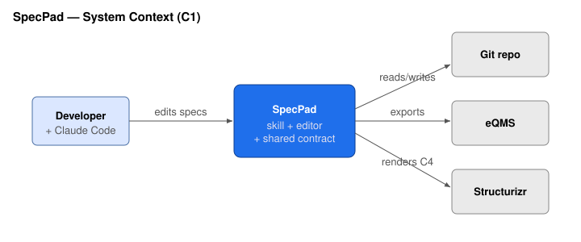
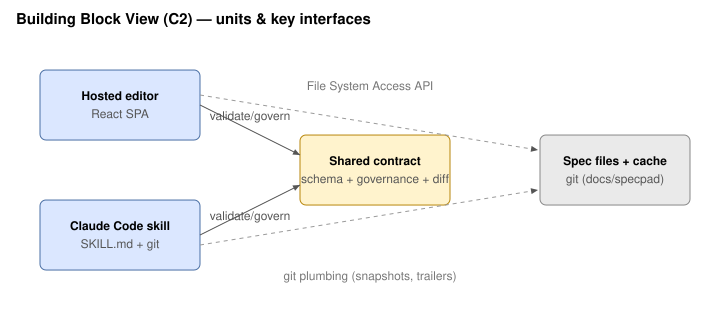
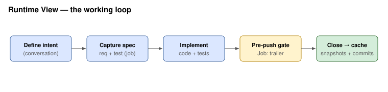

# SpecPad — Software Architecture Document (arc42)

> Generic profile (SpecPad is not a medical device — it's a faithful structural example). Diagrams are
> draw.io SVG exports, placed inline by this document; a Structurizr C4 model is an optional alternative.
> Job/release-coupled — the Jobs view shows how each change affected this. Authoring tact:
> `specpad.sad.guide.md`.

## 1. Introduction and Goals
SpecPad governs structured software documentation — **product requirements (user needs), software
requirements, verification tests, architecture, detailed design, and software risk** — as files in a git repo, edited by a Claude Code
skill and a hosted visual editor under one shared contract, producing change-tracked, exportable design
evidence. The set of document types is **open** (a registry): SOUP/SBOM, cybersecurity, and SDD are
planned pillars that plug into the same machinery. Quality goals: **low install friction**, a
**documentation digital-twin of the code**, and **reproducible, audit-grade evidence**. Stakeholders:
developers (with Claude Code), human spec editors, and (for regulated users) eQMS reviewers.

## 2. Constraints
- Static, backend-less hosted editor (S3 + CloudFront); file I/O is client-side (File System Access API).
- The **self-hosted server is optional and additive**: the hosted editor must keep working with no
  server at all, and the server must add no runtime dependency beyond Node's standard library and `git`.
- One shared v1 JSON contract governs the editor and the skill; git owns history.
- Version-pinned editor builds (`schemaVersion "1.0"` → `/v01/`); old builds stay live forever.
- The skill is prose + git plumbing (no CLI).

## 3. Context and Scope
A **developer** authors specs/code with Claude Code; a **reviewer** approves evidence in an external
**eQMS**. SpecPad reads/writes `docs/specpad/` in the developer's git repo, renders in the hosted
editor, and exports evidence. A third actor is the **spec editor without source access** (quality or
product): they reach the same files through a company-hosted SpecPad **server**, which holds the
clone on their behalf.

## 4. Solution Strategy
- **Contract-first:** `src/shared/` is the single source of truth both halves obey.
- **Risk reuses the trace rather than duplicating it.** A risk control measure is a software
  requirement (62304 §5.2.2), so the risk register references requirements instead of restating
  controls — and verification of the control (§7.3) is then the tests already verifying that
  requirement. Causes are software units, which is why a design section declares whether it is a unit
  or a cross-cutting view. Security risk is a separate process and gets its own register.
- **A design section is prose with an identity.** The detailed design (`sdd`) is an id-keyed register
  whose items are markdown *sections*, not fields: the design must be free to hold flowcharts and
  figures, while the stable per-section id is what requirements point at. Trace direction is
  **requirement → design** (`SrsItem.design`), so tests keep verifying requirements and the matrix
  renders PRD → SRS → SDD and SRS → VTP. The detailed design is authored at **maximum rigor always**;
  omitting it for a lower safety class or documentation level is an export decision, which is why no
  class or rigor level appears anywhere in the contract.
- **A document-type registry (`src/shared/docTypes.ts`) is the source of truth for which content
  document types exist** and how each behaves (id-keyed register vs prose vs asset). Validation, the
  snapshot/diff/redline, the generator, and the per-job impact evaluation all derive from it, so a new
  pillar (SOUP, cybersecurity, threat model) is one registration — as the detailed design and the risk
  register both were. The per-project list is the project index
  (`proj.json documents[]`).
- **Skill writes programmatically; humans edit visually; git merges.**
- **One transport seam, three sources.** Every view reaches documents through a four-method
  `FileApi` (`src/fileApi.ts`): local files, the read-only demo, or a self-hosted server. Where the
  project lives is not a concern of any view.
- **The server is a git client, not a database.** It holds a bare clone per project plus one
  sparse-checked-out worktree per user; a user's edits are an uncommitted draft until they Commit,
  and publication is an ordinary git commit authored by them. Governance runs server-side because
  the client is not trusted. Concurrency is resolved by an **item-id-keyed three-way merge**
  (`src/shared/merge.ts`), never a textual one.
- **Change tracking is git-derived** (release baselines + frozen closed-job caches) so the
  browser-based editor shows history without git access.
- **Jobs are the change spine:** a job ties its edits across *every* registered document type and its
  code commits together; the working loop evaluates a job's impact on each registered type.

## 5. Building Block View
Top-level units and the key interfaces between them:

| Unit | Responsibility | Key interfaces |
|------|----------------|----------------|
| Shared contract (`src/shared`) | Types + JSON Schemas, governance, id-keyed diff, **document-type registry** (`docTypes.ts`) | imported by editor; mirrored by skill |
| Editor (`src/`) | React SPA: Overview, PRD, SRS, VTP, Results, Architecture, **Detailed Design**, **Auditor (design-control map)**, **Traceability**, Releases, Jobs views; selectable **themes**; local file I/O | File System Access API; the contract |
| Skill (`skill/specpad`) | Scaffold, govern, cache, draft (generator), export; git plumbing | git; the contract; the eQMS export |
| Spec files + cache (`docs/specpad`) | proj/**prd**/srs/vtp/**sdd**/**risk** JSON, sad.md + diagrams, `.specpad/` baselines & job caches | git |
| Transport seam (`src/fileApi.ts`, `src/transports/`) | The editor's one door to documents: local / demo / remote implementations of `FileApi` | one conformance suite across all three |
| Server (`server/`) | Optional self-hosted multi-project server: identity, per-project authorization, per-user worktrees, the commit gate, HTTP API + SSE | the contract; git; an upstream SSO gateway |

## 6. Runtime View
The working loop: define intent → under an active job, **evaluate the job's impact on every registered
document type** (product requirements, requirements, verification, architecture, and any pillar) and
capture/update the affected ones **spec-first** → implement → the **pre-push hook** enforces a `Job:`
trailer → on create the skill snapshots the job's `before`, on close its `after` + commit list. The
editor diffs the caches (registry-generic, by document type) to show each job's impact, including the
active job's in-progress changes.

## 7. Deployment View
**Hosted (default):** private S3 bucket behind CloudFront (OAC), Route 53, ACM. Apex = marketing;
`/v01/` = editor; `/demo/` = demo content; `/staging/` = in-progress builds. Provisioned by the
private `specpad-infra` repo's `deploy.sh`.

**Self-hosted (optional):** one container inside the company network serving the same version-pinned
editor build *and* its API from a single origin, behind the company's existing authenticating proxy
(which supplies identity; SpecPad implements no authentication). **One deployment hosts several
projects** — a company with SpecPad in six repositories runs one server, not six — each with its own
repository, credential, and role map, under one sign-on. State on disk is `workDir/projects/<id>/`:
a bare clone plus one sparse worktree per user, all regenerable from git.

## 8. Crosscutting Concepts
Stable immutable ids; references target ids never labels; nothing derived is stored except the
committed, regenerable "lockfile" caches (release baselines, closed-job caches); governance enforced
identically by editor and skill from one module.

## 9. Architecture Decisions
**The server is optional and stays a git client** — no database, no SpecPad-owned identity, no
long-lived state that git could not rebuild; a company that wants none of it loses nothing.
**Identity is delegated** to whatever the company already runs (a proxy asserting headers), and is
deliberately separate from the git push credential: the human is the commit *author*, a machine
credential does the push. **Multi-project is tenancy inside one process** rather than one process
per repository: the project is a routing and authorization boundary (`/api/v1/p/<id>/…`, per-project
roles, per-project worktree directories and event streams), which is what makes one sign-on across
six repositories possible at all. **Concurrent editing is resolved structurally, never textually.**
Hosted-only editor with a version-pinned redirect launcher; git-derived change tracking; job-level
coupling for architecture (no req↔arch matrix); architecture authored as arc42 markdown + draw.io
diagrams (Structurizr C4 DSL optional); enforcement via an opt-in pre-push hook. **A document-type
registry makes document types extensible**: snapshots, per-job diffs, the redline, validation, the
reference page, the generator, and the per-job impact evaluation all derive from it, so a new pillar is
a registration rather than edits across the codebase. PRD↔SRS trace is by `satisfies` (ids) and SRS↔SDD by `design` (ids), both authored on the requirement
so each edge has one home; the Auditor view maps the evidence to design-control elements
(IEC 62304 / 21 CFR 820.30).

## 10. Quality Requirements
Install friction (one `init`); contract integrity (editor ↔ skill governance parity, parity-tested);
reproducibility of evidence (deterministic, versioned, git-backed); traceability (req↔test via
`verifies`, job→code via the `Job:` trailer).

## 11. Risks and Technical Debt
The **OIDC provider is unimplemented** (deployments use a proxy in front); the **container image is unbuilt and
untested**; a merge conflict is reported but not resolvable in place. Presence and the
upstream-moved signal are advisory and lost on restart, by design.
Per-job architecture diffs are coarse (file changed + SAD line diff, no in-diagram delta); the SAD is
prose and can drift — mitigated by the working loop's per-job impact evaluation across every registered
document type, but not hard-enforced by the pre-push gate; diagrams (draw.io SVGs) are updated by hand
and can lag the prose. The eQMS export format is not finalized; third-party components (SOUP/SBOM),
cybersecurity architecture and the threat model are planned pillars, not yet built. The
detailed design is complete: authored by the skill or in the browser, governed, snapshotted and diffed.

## 12. Glossary
PRD (product requirements / user needs), SRS (software requirements), VTP (verification tests), SAD
(this document), risk (the IEC 62304 clause 7 software risk analysis — hazardous situations software
contributes to, their causes and controls; the system risk management file stays with the quality
system), SDD (software detailed design — the units and design views implementing the
requirements; IEC 62304 5.4, FDA Software Design Specification, IEEE 1016 views), project (on a self-hosted server: one repository
it hosts, and the routing/authorization boundary around it), document-type registry (`docTypes.ts` — the source of
truth for content document types), Auditor view (the design-control map: IEC 62304 / 21 CFR 820.30 →
where evidence lives), Job (a design change), Release (a design checkpoint), SOUP/OTS (third-party
software — future SBOM pillar), eQMS (external quality system of record).
