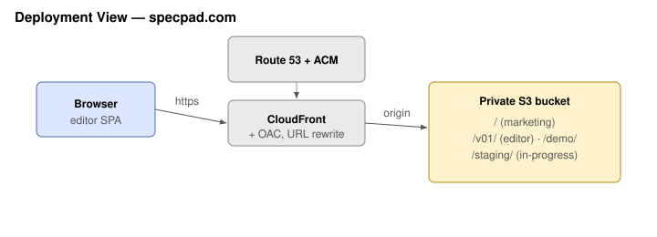

# SpecPad — Security Architecture

> The four views a premarket submission is expected to contain (FDA, *Cybersecurity in Medical
> Devices*, June 2025), with the security development lifecycle of IEC 81001-5-1 behind them. The
> threat model itself is `specpad.threat.json`; this document describes the system those threats act
> against. Where this and the arc42 architecture describe the same structure, the arc42 document is
> the source and this one is the security reading of it.

## 1. Global system view

What the system is, and every connection into and out of it.

SpecPad has two deployments with very different exposure, and conflating them is the first mistake a
reader can make.

**Hosted editor.** A static page served from a CDN, running entirely in the browser against the user's
own filesystem through the File System Access API. It has no server, no session, no stored credential
and no data at rest beyond the user's own repository. Its only network traffic is fetching its own
build and, in demo mode, a set of read-only sample documents.

**Self-hosted server.** The exposed deployment. One process serves the same editor build and an HTTP
API from a single origin, inside the company network:

| Connection | Direction | Trust |
|---|---|---|
| Browser → server | Inbound HTTP, through the company's authenticating proxy | Untrusted until the proxy asserts an identity |
| Proxy → server | Inbound, carrying identity headers | Trusted, and only from configured peer addresses |
| Server → git remote | Outbound, authenticated with a machine credential | Trusted |
| Server → filesystem | Local, confined to the configured work directory | — |
| Server → git binary | Local subprocess | — |

Two properties define the perimeter. **SpecPad implements no authentication**: identity is asserted by
an upstream the company already runs, and headers from any other peer are ignored. And **identity is
not the git credential**: the human is the commit author, a machine credential performs the push, so
compromising a session does not yield repository credentials.

## 2. Multi-patient harm view

How an attack on one deployment could reach beyond it.

SpecPad is a documentation tool, not a device that treats anyone; it has no patient-facing function and
no fleet. The multi-patient reading of this view is therefore indirect and worth stating plainly rather
than dismissing: **a compromised specification could misinform the development of a device that does
treat patients.** A falsified requirement or a silently weakened verification record is the harm path,
and it is slow, indirect, and mediated by human review.

The controls against it are the ones that make the record trustworthy rather than confidential:

- Every change is a git commit attributed to a person, and nothing is force-pushed or rewritten, so a
  falsified change cannot be made to disappear.
- Governance runs server-side, so a change that breaks traceability is refused regardless of the client.
- Verification results are derived from a captured run rather than typed, so a passing claim cannot be
  asserted by hand.

**Blast radius across projects.** A server hosting several projects is the one place where one team's
compromise could reach another's specification. Authorization is resolved per project rather than per
deployment, and each project holds a separate clone and per-user worktree, so the boundary is
structural rather than filtered (THR-3).

## 3. Updateability and patchability view

How a fix reaches a deployed instance.

| Deployment | Update path | Who acts |
|---|---|---|
| Hosted editor | New build published to the version path; next page load has it | SpecPad |
| Self-hosted server | New container image or checkout; operator redeploys | The operating company |
| The skill | Distributed with Claude Code; updated with it | The user |

The version path (`/v01/`) is derived from the contract version and old paths stay live indefinitely,
so an update never breaks a document authored against an earlier contract. A server deployment pins
whatever image the operator installed: **SpecPad cannot push an update to a self-hosted instance**, and
an operator who does not redeploy stays on the version they have. That is a deliberate property of
self-hosting rather than a gap, but it makes the vulnerability communication plan — which does not yet
exist, see below — the mechanism that matters.

State on disk is a bare clone and per-user worktrees under the work directory, all regenerable from
git, so an update never migrates data and a rollback loses nothing.

**Not yet documented:** monitoring of advisories, triage, disclosure to operators, and the timeline for
issuing a patched image. Recorded as gap 4 against JOB-51 rather than left implied.

## 4. Security use cases

The flows where an attacker's interest and the system's function meet.

**Signing in.** The proxy authenticates and asserts identity headers; the server maps group claims to a
role per project. A request from an untrusted peer is refused before any identity is read (THR-1). A
principal holding no role in a project is refused that project without affecting the others (THR-3).

**Reading and editing.** A read requires a role; a write requires one that permits editing, refused
server-side whatever the client rendered (THR-2). Every document path is validated before it reaches
git, and the working tree is sparse-checked-out so it cannot contain application source (THR-4).

**Publishing.** The commit gate validates and governs the change, commits it as the authenticated
human, rebases onto the branch and pushes with the machine credential. Nothing is force-pushed. A
concurrent change is merged structurally by item id, never textually, so a merge cannot silently drop
or duplicate content (THR-6).

**Rendering someone else's content.** Document bodies are authored by several people and rendered in
each other's browsers. The renderer emits no raw HTML and no raw-HTML plugin is configured, so content
cannot become markup (THR-5).

**Watching who is present.** Advisory presence is scoped to a project and requires a role in it, so it
never crosses a project boundary (THR-9). It is deliberately weak: claims expire on their own, nothing
blocks on them, and losing the registry costs a moment of silence.
